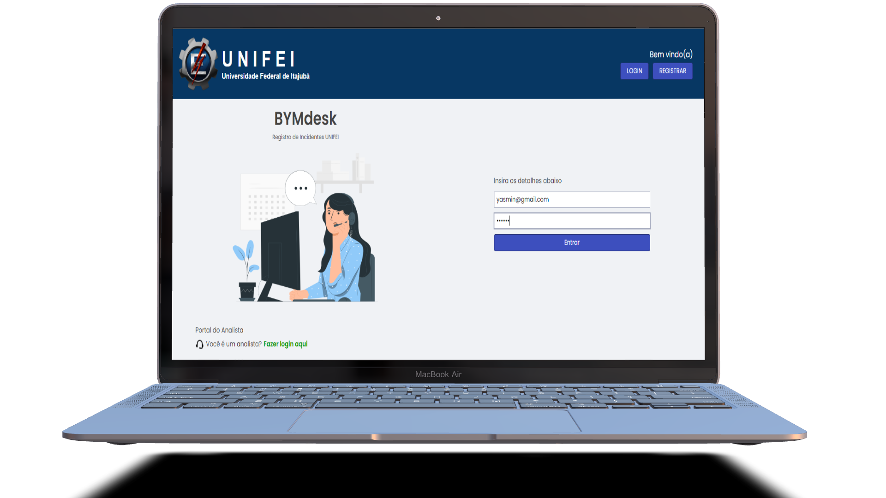

<h4 align="center">
    :computer: Bymdesk - Aplicação para gerenciamento de tickets de suporte para a UNIFEI
</h4>

<p align="center">
    <a href="#-projeto">Projeto</a>&nbsp;&nbsp;&nbsp;|&nbsp;&nbsp;&nbsp;
    <a href="#rocket-tecnologias">Tecnologias</a>&nbsp;&nbsp;&nbsp;|&nbsp;&nbsp;&nbsp;
    <a href="#user-content-clipboard-instruções">Instruções</a>&nbsp;&nbsp;&nbsp;|&nbsp;&nbsp;&nbsp;
    <a href="#-ajustes-e-melhorias">Melhorias</a>
</p>


<br/>

## 💻 Projeto

Frontend App em ReactJS. Plataforma web para gerenciamento de tickets de suporte para a UNIFEI. Com as funcionalidades de crud e relacionamentos para tickets, matricula, bloco, local e tela de login com autenticação.

Site: https://bymdesk.vercel.app/

Repositório Api vinculada: https://github.com/BrenoSamp/bym-desk-backend 

<br>

## :rocket: Tecnologias

- [Typescript](https://www.typescriptlang.org/)
- [ReactJS](https://pt-br.reactjs.org/)
- [styled-components](https://styled-components.com/)
- [material-ui](https://mui.com/pt/)
- [react-hook-form](https://react-hook-form.com/)
- [yup](https://www.npmjs.com/package/yup)
- [axios](https://axios-http.com/)

---

## :clipboard: Instruções

### INTERFACE - FRONTEND

- Execute `$ yarn` para instalar todas as dependencias.
- Crie um arquivo `.env` e preencha as informações de cada variável de ambiente, as variáveis para serem preenchidas se encontram no arquivo `env.example`.
- Após todas as dependencias serem instaladas e as variáveis serem preenchidas, basta executar `yarn start` para iniciar a interface frontend.

## Exemplo de processo para alterações no projeto

- 1 - Estar no ambiente de dev

```bash
git checkout dev
```

- 2 - Atualizar o ambiente de dev (git pull)

```bash
git pull
```

- 3 - Após a atualização criar uma nova branch para alteração, exemplo:

```bash
git checkout -b feature/create-user
```

- 4 - Após as alterações no código, subir as alterações na branch recém criada:

```bash
git add . && git commit -m "feat: create User" && git push origin feature/create-user
```

- 5 - Clicar no primeiro link que estiver no terminal que levará direto para o github.
  Clicar em Create Pull Request, e em seguida se não houver nenhum conflito e após ultima validação das alterações, clicar em Merge request. Com isso a branch de DEV será atualizada com as alterações realizadas.
  E por fim clicar em delete branch, para finalizar a branch que ocorreu a alteração caso esteja finalizado toda aquela demanda.

- 6 - Logo após voltar para a branch dev no VSCode (git checkout dev) e executar o comando para atualizar a DEV
  (git pull). Assim a branch DEV estará atualizada no seu repositório local. E para uma nova demanda, seguir novamente os mesmos passos, criar uma nova branch a partir da dev ...

---

## 📌 Ajustes e melhorias

O projeto ainda está em desenvolvimento e as próximas atualizações serão voltadas nas seguintes tarefas:

- [ ] integração de telas com backend
